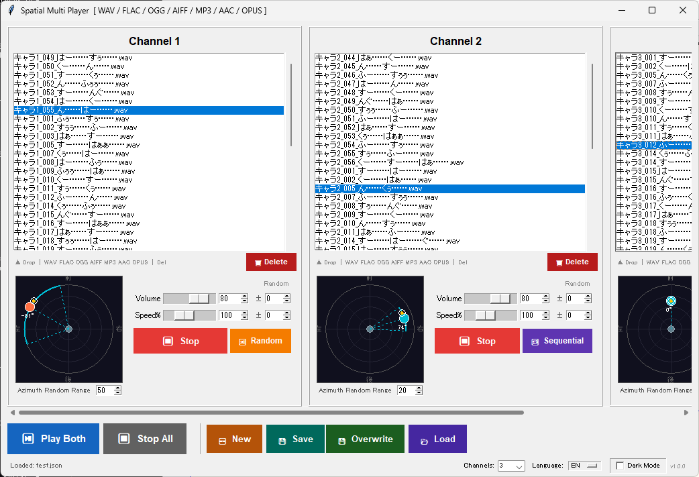

# Spatial Dual Player

2つの音声ファイルを独立した空間定位で同時再生できる、デュアルチャンネル音声プレイヤーです。  
A dual-channel audio player that plays two audio files independently with spatial positioning.



---

## 特徴 / Features

- **デュアルチャンネル独立再生** — 2つの音声ファイルをそれぞれ独立したチャンネルで再生
- **空間定位（バイノーラル）** — クリック/ドラッグで音源の方向・距離を3D空間内で設定（ヘッドフォン推奨）
- **連続再生 / ランダム再生** — リスト内を順番またはランダムに連続再生
- **多形式対応** — WAV / FLAC / OGG / AIFF / MP3 / AAC / OPUS
- **フォルダドロップ対応** — フォルダをドロップするとその中の音声ファイルを一括追加
- **ランダム変動** — 音量・速度・方向を再生ごとにランダムに変化させる
- **ダークモード / 言語切替** — EN / JA 対応、言語ファイルを追加するだけで多言語化可能
- **設定の保存/ロード** — ファイルリスト・音量・速度・位置を JSON に保存

---

## 動作環境 / Requirements

| 項目 | 内容 |
|---|---|
| OS | Windows 10/11（macOS / Linux は一部機能が異なる場合あり） |
| Python | 3.10 以上 |
| ヘッドフォン | 空間定位効果にはヘッドフォン必須（スピーカーでは効果なし） |

---

## インストール / Installation

### 1. Python をインストール

https://www.python.org/downloads/ から Python 3.10 以上をダウンロードしてインストールしてください。  
**インストール時に「Add Python to PATH」にチェックを入れてください。**

### 2. リポジトリをクローン

```bash
git clone https://github.com/tougenkyo/spatial-dual-player.git
cd spatial-dual-player
```

または右上の **「Code」→「Download ZIP」** でダウンロードして展開してください。

### 3. 起動

`start.bat` をダブルクリックするだけで起動できます。

```bash
# またはコマンドラインから
python binaural_player.py
```

**初回起動時、不足しているライブラリ（numpy, sounddevice 等）の自動インストールを促すダイアログが表示されます。**  
「はい / Yes」を選択するとインストールが自動で行われます。

手動でインストールする場合：

```bash
pip install -r requirements.txt
```

---

## MP3 / AAC / OPUS の再生

MP3・AAC・OPUS の再生には **FFmpeg** が必要です。

- **自動ダウンロード（Windows）**: 初めてこれらの形式のファイルをドロップすると、自動ダウンロードのダイアログが表示されます
- **手動インストール**: https://ffmpeg.org/download.html からダウンロード、または `winget install ffmpeg`

> FFmpeg はスクリプトと同じフォルダの `ffmpeg_bin/` に保存されます（PATH への追加不要）

---

## 言語の追加 / Adding a Language

`language/` フォルダに新しい JSON ファイルを追加するだけで翻訳が追加されます。

```
language/
  en.json   ← 英語
  ja.json   ← 日本語
  fr.json   ← フランス語（追加例）
```

`en.json` をコピーして翻訳してください。ファイル名がそのまま言語コードになります。

---

## フォルダ構成 / Directory Structure

```
spatial_dual_player.py    メインスクリプト
start.bat              Windows 用起動スクリプト
requirements.txt       依存ライブラリ一覧
language/
  en.json              英語翻訳ファイル
  ja.json              日本語翻訳ファイル
images/
  screenshot.png       スクリーンショット
config/                設定ファイル保存先（自動生成・gitignore済み）
ffmpeg_bin/            FFmpeg バイナリ（自動DL時・gitignore済み）
```

---

## 依存ライブラリのライセンス / Third-party Licenses

| ライブラリ | ライセンス |
|---|---|
| numpy | BSD |
| sounddevice | MIT |
| soundfile | BSD |
| tkinterdnd2 | MIT |
| FFmpeg（別途取得）| LGPL / GPL（バイナリは本リポジトリに含まれません） |

FFmpeg のバイナリはユーザー自身がダウンロードするものであり、本リポジトリには含まれていません。

---

## ライセンス / License

MIT License — 詳細は [LICENSE](LICENSE) を参照してください。
